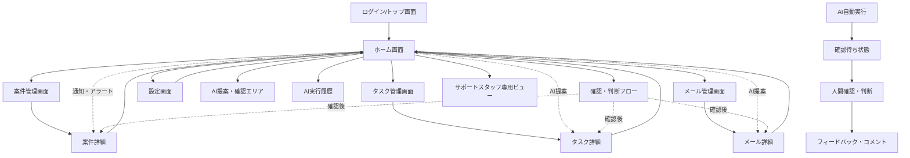

# SalesOn 画面遷移図

本ドキュメントはSalesOnの主要画面遷移をMermaid記法で示したものです。

---

---

## 画面遷移の詳細説明

### 基本遷移
- ログイン/トップ画面からホーム画面へ遷移
- ホームから案件管理・タスク管理・メール管理・設定画面へ遷移
- 各リスト画面から詳細画面へ遷移
- 詳細画面や設定画面からホームへ戻る

### ホーム画面内の遷移
- **AI提案・確認エリア**: AIからの提案を確認・判断
- **AI実行履歴**: AIの自動実行履歴を時系列で表示
- **確認・判断フロー**: AI提案に対する人間の確認・判断プロセス
- **サポートスタッフ専用ビュー**: サポートスタッフ向けの特別なビュー

### AI自動化フロー
1. **AI自動実行**: AIが自動でアクションを実行
2. **確認待ち状態**: 人間の確認を待つ状態
3. **人間確認・判断**: 人間による確認・判断・実行指示
4. **フィードバック・コメント**: 結果の記録・フィードバック

### 通知・アラートによる直接遷移
- ホームから通知・アラートによる直接遷移（dotted line）
- AI提案による直接遷移（dotted line）
- 確認フローからの遷移（dotted line）

### サポートスタッフ専用機能
- サポートスタッフ専用ビューへの分岐
- 顧客対応履歴とAI提案の紐付け表示
- サポート案件の特別な処理フロー 