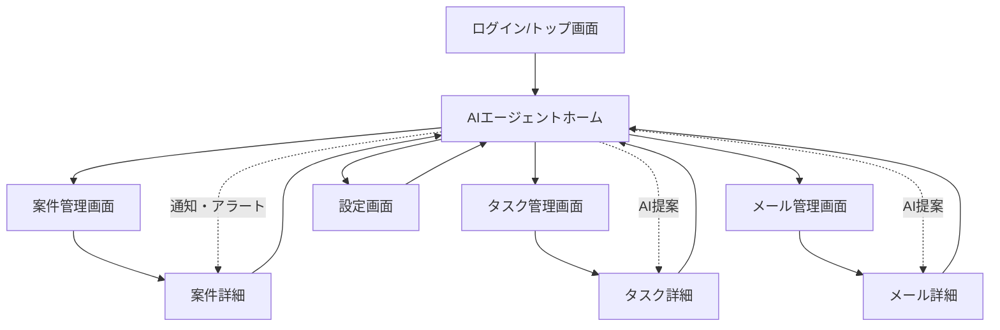

# SalesOn 画面遷移図

本ドキュメントはSalesOnの主要画面遷移をMermaid記法で示したものです。

---

---

- ログイン/トップ画面からAIエージェントホームへ遷移
- ホームから案件管理・タスク管理・メール管理・設定画面へ遷移
- 各リスト画面から詳細画面へ遷移
- 詳細画面や設定画面からホームへ戻る
- ホームから通知・AI提案による直接遷移も dotted line で表現 