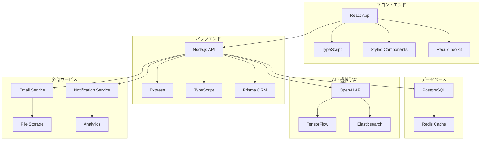

# システム設計書

本ドキュメントは、営業支援システムの技術設計、アーキテクチャ、データベース設計を含む包括的なシステム設計書です。ER図に基づくデータ設計と、統合エージェントインボックスを中心とした技術実装の詳細を説明します。

---

## 目次

1. [システムアーキテクチャ](#システムアーキテクチャ)
2. [データベース設計](#データベース設計)
3. [API設計](#api設計)
4. [セキュリティ設計](#セキュリティ設計)
5. [パフォーマンス設計](#パフォーマンス設計)
6. [運用設計](#運用設計)
7. [技術スタック](#技術スタック)

---

## システムアーキテクチャ

### 全体アーキテクチャ



### レイヤードアーキテクチャ

#### 1. プレゼンテーション層
| コンポーネント | 技術 | 責任 |
|:---|:---|:---|
| **UI Components** | React + TypeScript | ・ユーザーインターフェース表示<br>・ユーザー入力処理<br>・状態管理 |
| **Routing** | React Router | ・ページ遷移管理<br>・URL管理<br>・認証制御 |
| **State Management** | Redux Toolkit | ・アプリケーション状態管理<br>・データフロー制御<br>・キャッシュ管理 |

#### 2. ビジネスロジック層
| コンポーネント | 技術 | 責任 |
|:---|:---|:---|
| **API Controllers** | Express + TypeScript | ・HTTPリクエスト処理<br>・バリデーション<br>・レスポンス生成 |
| **Business Services** | TypeScript | ・ビジネスロジック実装<br>・データ処理<br>・外部サービス連携 |
| **AI Services** | OpenAI + TensorFlow | ・自然言語処理<br>・機械学習<br>・予測分析 |

#### 3. データアクセス層
| コンポーネント | 技術 | 責任 |
|:---|:---|:---|
| **ORM** | Prisma | ・データベース操作<br>・スキーマ管理<br>・マイグレーション |
| **Cache** | Redis | ・セッション管理<br>・キャッシュ管理<br>・リアルタイム処理 |
| **Search** | Elasticsearch | ・全文検索<br>・インデックス管理<br>・検索最適化 |

### マイクロサービス設計

#### 1. コアサービス
| サービス | 責任 | 技術 |
|:---|:---|:---|
| **User Service** | ユーザー管理・認証 | Node.js + JWT |
| **Communication Service** | メール・チャット管理 | Node.js + WebSocket |
| **Task Service** | タスク管理 | Node.js + Redis |
| **Opportunity Service** | 案件管理 | Node.js + PostgreSQL |

#### 2. AIサービス
| サービス | 責任 | 技術 |
|:---|:---|:---|
| **AI Assistant Service** | 対話・提案 | OpenAI API + TensorFlow |
| **Signal Monitoring Service** | 環境シグナル監視 | TensorFlow + NLP |
| **Analytics Service** | 分析・予測 | TensorFlow + Elasticsearch |

#### 3. インフラサービス
| サービス | 責任 | 技術 |
|:---|:---|:---|
| **Notification Service** | 通知管理 | Node.js + WebSocket |
| **File Service** | ファイル管理 | Node.js + S3 |
| **Email Service** | メール送信 | Node.js + SMTP |

---

## データベース設計

### ER図設計

#### 主要エンティティとその関係

| エンティティ名 | 日本語名 | 説明 | 主な関連エンティティ |
|:---|:---|:---|:---|
| Tenant | テナント | サービスを利用する組織やグループの単位 | User, Company |
| User | ユーザー | サービスを利用する個人 | Tenant, Team, Task, Message |
| Team | チーム | ユーザーのグループ | User |
| Company | 企業 | 案件やユーザー、タスクと関連 | Tenant, Opportunity, Task, User |
| Opportunity | 案件 | 企業に紐づくビジネス案件 | Company, Task, Message, Minutes |
| Task | タスク | 案件やユーザー、企業に紐づく作業項目 | Opportunity, User, Company |
| Message | メッセージ | 案件やユーザー、企業に紐づくコミュニケーション | Opportunity, User, Company, Reaction, Minutes |
| Reaction | リアクション | メッセージに対する反応 | Message |
| Minutes | 議事録 | 案件やメッセージに紐づく議事録情報 | Opportunity, Message |

#### サブタイプ設計
- **Message（メッセージ）**は、用途に応じて以下のサブタイプに分かれます：
  - EmailMessage（電子メール）
  - InternalMessage（社内チャット）
  - BotMessage（チャットボット）

### データベーススキーマ

#### 1. ユーザー管理テーブル

```sql
-- テナントテーブル
CREATE TABLE tenants (
    id UUID PRIMARY KEY DEFAULT gen_random_uuid(),
    name VARCHAR(255) NOT NULL,
    domain VARCHAR(255) UNIQUE,
    settings JSONB DEFAULT '{}',
    created_at TIMESTAMP DEFAULT CURRENT_TIMESTAMP,
    updated_at TIMESTAMP DEFAULT CURRENT_TIMESTAMP
);

-- ユーザーテーブル
CREATE TABLE users (
    id UUID PRIMARY KEY DEFAULT gen_random_uuid(),
    tenant_id UUID REFERENCES tenants(id),
    email VARCHAR(255) UNIQUE NOT NULL,
    password_hash VARCHAR(255) NOT NULL,
    first_name VARCHAR(100),
    last_name VARCHAR(100),
    role VARCHAR(50) DEFAULT 'user',
    status VARCHAR(20) DEFAULT 'active',
    settings JSONB DEFAULT '{}',
    created_at TIMESTAMP DEFAULT CURRENT_TIMESTAMP,
    updated_at TIMESTAMP DEFAULT CURRENT_TIMESTAMP
);

-- チームテーブル
CREATE TABLE teams (
    id UUID PRIMARY KEY DEFAULT gen_random_uuid(),
    tenant_id UUID REFERENCES tenants(id),
    name VARCHAR(255) NOT NULL,
    description TEXT,
    created_at TIMESTAMP DEFAULT CURRENT_TIMESTAMP,
    updated_at TIMESTAMP DEFAULT CURRENT_TIMESTAMP
);

-- ユーザーチーム関連テーブル
CREATE TABLE user_teams (
    user_id UUID REFERENCES users(id),
    team_id UUID REFERENCES teams(id),
    role VARCHAR(50) DEFAULT 'member',
    created_at TIMESTAMP DEFAULT CURRENT_TIMESTAMP,
    PRIMARY KEY (user_id, team_id)
);
```

#### 2. 企業・案件管理テーブル

```sql
-- 企業テーブル
CREATE TABLE companies (
    id UUID PRIMARY KEY DEFAULT gen_random_uuid(),
    tenant_id UUID REFERENCES tenants(id),
    name VARCHAR(255) NOT NULL,
    domain VARCHAR(255),
    industry VARCHAR(100),
    size VARCHAR(50),
    contact_info JSONB DEFAULT '{}',
    created_at TIMESTAMP DEFAULT CURRENT_TIMESTAMP,
    updated_at TIMESTAMP DEFAULT CURRENT_TIMESTAMP
);

-- 案件テーブル
CREATE TABLE opportunities (
    id UUID PRIMARY KEY DEFAULT gen_random_uuid(),
    company_id UUID REFERENCES companies(id),
    assigned_user_id UUID REFERENCES users(id),
    title VARCHAR(255) NOT NULL,
    description TEXT,
    status VARCHAR(50) DEFAULT 'prospect',
    value DECIMAL(15,2),
    probability DECIMAL(5,2),
    expected_close_date DATE,
    actual_close_date DATE,
    created_at TIMESTAMP DEFAULT CURRENT_TIMESTAMP,
    updated_at TIMESTAMP DEFAULT CURRENT_TIMESTAMP
);
```

#### 3. タスク管理テーブル

```sql
-- タスクテーブル
CREATE TABLE tasks (
    id UUID PRIMARY KEY DEFAULT gen_random_uuid(),
    opportunity_id UUID REFERENCES opportunities(id),
    assigned_user_id UUID REFERENCES users(id),
    company_id UUID REFERENCES companies(id),
    title VARCHAR(255) NOT NULL,
    description TEXT,
    status VARCHAR(50) DEFAULT 'pending',
    priority VARCHAR(20) DEFAULT 'medium',
    due_date TIMESTAMP,
    completed_at TIMESTAMP,
    created_at TIMESTAMP DEFAULT CURRENT_TIMESTAMP,
    updated_at TIMESTAMP DEFAULT CURRENT_TIMESTAMP
);

-- タスクコメントテーブル
CREATE TABLE task_comments (
    id UUID PRIMARY KEY DEFAULT gen_random_uuid(),
    task_id UUID REFERENCES tasks(id),
    user_id UUID REFERENCES users(id),
    content TEXT NOT NULL,
    created_at TIMESTAMP DEFAULT CURRENT_TIMESTAMP
);
```

#### 4. コミュニケーション管理テーブル

```sql
-- メッセージテーブル
CREATE TABLE messages (
    id UUID PRIMARY KEY DEFAULT gen_random_uuid(),
    opportunity_id UUID REFERENCES opportunities(id),
    sender_user_id UUID REFERENCES users(id),
    recipient_user_id UUID REFERENCES users(id),
    company_id UUID REFERENCES companies(id),
    type VARCHAR(20) NOT NULL, -- email, internal, bot
    subject VARCHAR(255),
    content TEXT NOT NULL,
    metadata JSONB DEFAULT '{}',
    created_at TIMESTAMP DEFAULT CURRENT_TIMESTAMP,
    updated_at TIMESTAMP DEFAULT CURRENT_TIMESTAMP
);

-- リアクションテーブル
CREATE TABLE reactions (
    id UUID PRIMARY KEY DEFAULT gen_random_uuid(),
    message_id UUID REFERENCES messages(id),
    user_id UUID REFERENCES users(id),
    reaction_type VARCHAR(20) NOT NULL,
    created_at TIMESTAMP DEFAULT CURRENT_TIMESTAMP
);

-- 議事録テーブル
CREATE TABLE minutes (
    id UUID PRIMARY KEY DEFAULT gen_random_uuid(),
    opportunity_id UUID REFERENCES opportunities(id),
    title VARCHAR(255) NOT NULL,
    content TEXT NOT NULL,
    participants JSONB DEFAULT '[]',
    action_items JSONB DEFAULT '[]',
    decisions JSONB DEFAULT '[]',
    meeting_date TIMESTAMP,
    created_at TIMESTAMP DEFAULT CURRENT_TIMESTAMP,
    updated_at TIMESTAMP DEFAULT CURRENT_TIMESTAMP
);
```

#### 5. AI・分析テーブル

```sql
-- AI実行ログテーブル
CREATE TABLE ai_executions (
    id UUID PRIMARY KEY DEFAULT gen_random_uuid(),
    user_id UUID REFERENCES users(id),
    task_id UUID REFERENCES tasks(id),
    execution_type VARCHAR(50) NOT NULL,
    input_data JSONB,
    output_data JSONB,
    status VARCHAR(20) DEFAULT 'pending',
    error_message TEXT,
    created_at TIMESTAMP DEFAULT CURRENT_TIMESTAMP,
    completed_at TIMESTAMP
);

-- 環境シグナルログテーブル
CREATE TABLE signal_logs (
    id UUID PRIMARY KEY DEFAULT gen_random_uuid(),
    source_type VARCHAR(50) NOT NULL, -- email, minutes, task
    source_id UUID NOT NULL,
    signal_type VARCHAR(50) NOT NULL,
    signal_data JSONB NOT NULL,
    processed_at TIMESTAMP,
    created_at TIMESTAMP DEFAULT CURRENT_TIMESTAMP
);
```

#### 6. 通知テーブル

```sql
-- 通知テーブル
CREATE TABLE notifications (
    id UUID PRIMARY KEY DEFAULT gen_random_uuid(),
    user_id UUID REFERENCES users(id),
    type VARCHAR(50) NOT NULL, -- 'opportunity_update', 'task_update', 'system_alert'
    title VARCHAR(255) NOT NULL,
    message TEXT NOT NULL,
    importance_level INTEGER DEFAULT 1, -- 1: low, 2: medium, 3: high
    is_read BOOLEAN DEFAULT FALSE,
    related_entity_type VARCHAR(50), -- 'opportunity', 'task', 'message'
    related_entity_id UUID,
    created_at TIMESTAMP DEFAULT CURRENT_TIMESTAMP,
    updated_at TIMESTAMP DEFAULT CURRENT_TIMESTAMP
);

-- 通知設定テーブル
CREATE TABLE notification_settings (
    id UUID PRIMARY KEY DEFAULT gen_random_uuid(),
    user_id UUID REFERENCES users(id),
    notification_type VARCHAR(50) NOT NULL,
    is_enabled BOOLEAN DEFAULT TRUE,
    importance_threshold INTEGER DEFAULT 1,
    delivery_method VARCHAR(50) DEFAULT 'in_app', -- 'in_app', 'email', 'slack'
    created_at TIMESTAMP DEFAULT CURRENT_TIMESTAMP,
    updated_at TIMESTAMP DEFAULT CURRENT_TIMESTAMP
);
```

### インデックス設計

#### 1. パフォーマンス最適化インデックス

```sql
-- ユーザー関連
CREATE INDEX idx_users_tenant_email ON users(tenant_id, email);
CREATE INDEX idx_users_status ON users(status);

-- 案件関連
CREATE INDEX idx_opportunities_company ON opportunities(company_id);
CREATE INDEX idx_opportunities_assigned_user ON opportunities(assigned_user_id);
CREATE INDEX idx_opportunities_status ON opportunities(status);

-- タスク関連
CREATE INDEX idx_tasks_assigned_user ON tasks(assigned_user_id);
CREATE INDEX idx_tasks_due_date ON tasks(due_date);
CREATE INDEX idx_tasks_status ON tasks(status);

-- メッセージ関連
CREATE INDEX idx_messages_opportunity ON messages(opportunity_id);
CREATE INDEX idx_messages_created_at ON messages(created_at);
CREATE INDEX idx_messages_type ON messages(type);

-- AI実行関連
CREATE INDEX idx_ai_executions_user ON ai_executions(user_id);
CREATE INDEX idx_ai_executions_status ON ai_executions(status);
CREATE INDEX idx_ai_executions_created_at ON ai_executions(created_at);
```

#### 2. 全文検索インデックス

```sql
-- メッセージ内容の全文検索
CREATE INDEX idx_messages_content_fts ON messages USING gin(to_tsvector('english', content));

-- 議事録内容の全文検索
CREATE INDEX idx_minutes_content_fts ON minutes USING gin(to_tsvector('english', content));

-- タスク内容の全文検索
CREATE INDEX idx_tasks_content_fts ON tasks USING gin(to_tsvector('english', title || ' ' || COALESCE(description, '')));
```

---

## API設計

### RESTful API設計

#### 1. 認証・認可API

```typescript
// 認証API
POST /api/auth/login
POST /api/auth/logout
POST /api/auth/refresh
POST /api/auth/forgot-password
POST /api/auth/reset-password

// ユーザー管理API
GET /api/users
GET /api/users/:id
PUT /api/users/:id
DELETE /api/users/:id
```

#### 2. 案件管理API

```typescript
// 案件API
GET /api/opportunities
POST /api/opportunities
GET /api/opportunities/:id
PUT /api/opportunities/:id
DELETE /api/opportunities/:id

// 案件検索API
GET /api/opportunities/search
GET /api/opportunities/company/:companyId
```

#### 3. タスク管理API

```typescript
// タスクAPI
GET /api/tasks
POST /api/tasks
GET /api/tasks/:id
PUT /api/tasks/:id
DELETE /api/tasks/:id

// タスクフィルターAPI
GET /api/tasks/user/:userId
GET /api/tasks/opportunity/:opportunityId
GET /api/tasks/due-date/:date
```

#### 4. コミュニケーションAPI

```typescript
// メッセージAPI
GET /api/messages
POST /api/messages
GET /api/messages/:id
PUT /api/messages/:id
DELETE /api/messages/:id

// 議事録API
GET /api/minutes
POST /api/minutes
GET /api/minutes/:id
PUT /api/minutes/:id
DELETE /api/minutes/:id
```

#### 5. AI・分析API

```typescript
// AI対話API
POST /api/ai/chat
POST /api/ai/analyze
POST /api/ai/execute

// 環境シグナルAPI
GET /api/signals
POST /api/signals/process
GET /api/signals/analytics
```

#### 6. 通知API

```typescript
// 通知API
GET /api/notifications
POST /api/notifications
GET /api/notifications/:id
PUT /api/notifications/:id
DELETE /api/notifications/:id
PUT /api/notifications/:id/read

// 通知設定API
GET /api/notification-settings
POST /api/notification-settings
PUT /api/notification-settings/:id
DELETE /api/notification-settings/:id
```

### WebSocket API設計

#### 1. リアルタイム通信

```typescript
// 通知WebSocket
ws://api.example.com/ws/notifications
{
  "type": "notification",
  "data": {
    "id": "uuid",
    "title": "新しいタスク",
    "message": "A社からの問い合わせ",
    "priority": "high",
    "timestamp": "2024-01-01T00:00:00Z"
  }
}

// チャットWebSocket
ws://api.example.com/ws/chat
{
  "type": "message",
  "data": {
    "id": "uuid",
    "sender": "user_id",
    "content": "今日のタスク教えて",
    "timestamp": "2024-01-01T00:00:00Z"
  }
}

// データ更新WebSocket
ws://api.example.com/ws/updates
{
  "type": "task_update",
  "data": {
    "task_id": "uuid",
    "status": "completed",
    "updated_at": "2024-01-01T00:00:00Z"
  }
}
```

### APIレスポンス形式

#### 1. 標準レスポンス形式

```typescript
// 成功レスポンス
{
  "success": true,
  "data": {
    // レスポンスデータ
  },
  "message": "操作が完了しました",
  "timestamp": "2024-01-01T00:00:00Z"
}

// エラーレスポンス
{
  "success": false,
  "error": {
    "code": "VALIDATION_ERROR",
    "message": "バリデーションエラーが発生しました",
    "details": [
      {
        "field": "email",
        "message": "メールアドレスが無効です"
      }
    ]
  },
  "timestamp": "2024-01-01T00:00:00Z"
}
```

#### 2. ページネーション形式

```typescript
{
  "success": true,
  "data": {
    "items": [
      // アイテム配列
    ],
    "pagination": {
      "page": 1,
      "limit": 20,
      "total": 100,
      "totalPages": 5
    }
  }
}
```

---

## セキュリティ設計

### 認証・認可設計

#### 1. JWT認証

```typescript
// JWTペイロード構造
interface JWTPayload {
  userId: string;
  tenantId: string;
  email: string;
  role: string;
  permissions: string[];
  iat: number;
  exp: number;
}

// トークン管理
class TokenManager {
  generateAccessToken(user: User): string;
  generateRefreshToken(user: User): string;
  verifyToken(token: string): JWTPayload;
  refreshToken(refreshToken: string): string;
}
```

#### 2. RBAC（ロールベースアクセス制御）

```typescript
// ロール定義
enum UserRole {
  ADMIN = 'admin',
  MANAGER = 'manager',
  SALES = 'sales',
  VIEWER = 'viewer'
}

// 権限定義
enum Permission {
  READ_OPPORTUNITIES = 'read:opportunities',
  WRITE_OPPORTUNITIES = 'write:opportunities',
  DELETE_OPPORTUNITIES = 'delete:opportunities',
  READ_TASKS = 'read:tasks',
  WRITE_TASKS = 'write:tasks',
  DELETE_TASKS = 'delete:tasks',
  // ... その他の権限
}

// 権限チェック
class PermissionChecker {
  hasPermission(user: User, permission: Permission): boolean;
  hasRole(user: User, role: UserRole): boolean;
  checkAccess(user: User, resource: string, action: string): boolean;
}
```

### データ保護設計

#### 1. 暗号化

```typescript
// データ暗号化
class EncryptionService {
  encryptSensitiveData(data: string): string;
  decryptSensitiveData(encryptedData: string): string;
  hashPassword(password: string): string;
  verifyPassword(password: string, hash: string): boolean;
}

// 通信暗号化
const httpsOptions = {
  key: fs.readFileSync('private-key.pem'),
  cert: fs.readFileSync('certificate.pem'),
  ca: fs.readFileSync('ca-certificate.pem')
};
```

#### 2. 監査ログ

```typescript
// 監査ログ構造
interface AuditLog {
  id: string;
  userId: string;
  tenantId: string;
  action: string;
  resource: string;
  resourceId: string;
  oldValue?: any;
  newValue?: any;
  ipAddress: string;
  userAgent: string;
  timestamp: Date;
}

// 監査ログサービス
class AuditLogService {
  logAction(user: User, action: string, resource: string, details?: any): void;
  getAuditLogs(filters: AuditLogFilters): AuditLog[];
  exportAuditLogs(filters: AuditLogFilters, format: string): Buffer;
}
```

---

## パフォーマンス設計

### キャッシュ戦略

#### 1. Redisキャッシュ

```typescript
// キャッシュキー設計
const cacheKeys = {
  user: (id: string) => `user:${id}`,
  opportunity: (id: string) => `opportunity:${id}`,
  task: (id: string) => `task:${id}`,
  userTasks: (userId: string) => `user:${userId}:tasks`,
  opportunityMessages: (opportunityId: string) => `opportunity:${opportunityId}:messages`
};

// キャッシュサービス
class CacheService {
  async get<T>(key: string): Promise<T | null>;
  async set<T>(key: string, value: T, ttl?: number): Promise<void>;
  async delete(key: string): Promise<void>;
  async invalidatePattern(pattern: string): Promise<void>;
}
```

#### 2. データベース最適化

```sql
-- クエリ最適化
-- 複合インデックス
CREATE INDEX idx_opportunities_company_status ON opportunities(company_id, status);
CREATE INDEX idx_tasks_user_status_due ON tasks(assigned_user_id, status, due_date);

-- パーティショニング
CREATE TABLE messages_2024 PARTITION OF messages
FOR VALUES FROM ('2024-01-01') TO ('2025-01-01');

-- マテリアライズドビュー
CREATE MATERIALIZED VIEW user_task_summary AS
SELECT 
  user_id,
  COUNT(*) as total_tasks,
  COUNT(*) FILTER (WHERE status = 'completed') as completed_tasks,
  COUNT(*) FILTER (WHERE due_date < NOW()) as overdue_tasks
FROM tasks
GROUP BY user_id;
```

### 非同期処理設計

#### 1. ジョブキュー

```typescript
// ジョブタイプ定義
enum JobType {
  EMAIL_SEND = 'email_send',
  AI_ANALYSIS = 'ai_analysis',
  REPORT_GENERATION = 'report_generation',
  DATA_SYNC = 'data_sync'
}

// ジョブサービス
class JobService {
  async enqueueJob(type: JobType, data: any): Promise<string>;
  async processJob(jobId: string): Promise<void>;
  async getJobStatus(jobId: string): Promise<JobStatus>;
  async retryJob(jobId: string): Promise<void>;
}
```

#### 2. バッチ処理

```typescript
// バッチ処理スケジュール
const batchSchedules = {
  daily: '0 0 * * *',      // 毎日0時
  hourly: '0 * * * *',     // 毎時0分
  every5min: '*/5 * * * *' // 5分毎
};

// バッチ処理サービス
class BatchService {
  async runDailyBatch(): Promise<void>;
  async runHourlyBatch(): Promise<void>;
  async runSignalAnalysis(): Promise<void>;
  async runDataCleanup(): Promise<void>;
}
```

---

## 運用設計

### 監視・ログ設計

#### 1. アプリケーションログ

```typescript
// ログレベル定義
enum LogLevel {
  ERROR = 'error',
  WARN = 'warn',
  INFO = 'info',
  DEBUG = 'debug'
}

// ログサービス
class LogService {
  error(message: string, context?: any): void;
  warn(message: string, context?: any): void;
  info(message: string, context?: any): void;
  debug(message: string, context?: any): void;
}
```

#### 2. メトリクス収集

```typescript
// メトリクス定義
interface Metrics {
  apiRequests: number;
  responseTime: number;
  errorRate: number;
  activeUsers: number;
  aiExecutions: number;
  signalProcessings: number;
}

// メトリクスサービス
class MetricsService {
  incrementCounter(name: string, value?: number): void;
  recordTiming(name: string, duration: number): void;
  setGauge(name: string, value: number): void;
  getMetrics(): Metrics;
}
```

### バックアップ・復旧設計

#### 1. データベースバックアップ

```sql
-- 自動バックアップ設定
-- PostgreSQLのpg_dumpを使用
-- 日次フルバックアップ
-- 1時間毎の差分バックアップ

-- バックアップスクリプト
#!/bin/bash
DATE=$(date +%Y%m%d_%H%M%S)
pg_dump -h localhost -U postgres -d sales_support > backup_$DATE.sql
gzip backup_$DATE.sql
aws s3 cp backup_$DATE.sql.gz s3://backup-bucket/
```

#### 2. 災害復旧計画

```typescript
// 復旧手順
class DisasterRecoveryService {
  async createBackup(): Promise<string>;
  async restoreFromBackup(backupId: string): Promise<void>;
  async validateBackup(backupId: string): Promise<boolean>;
  async switchToBackupSite(): Promise<void>;
}
```

---

## 技術スタック

### フロントエンド

| 技術 | バージョン | 用途 |
|:---|:---|:---|
| **React** | 18.x | UIフレームワーク |
| **TypeScript** | 5.x | 型安全性 |
| **Redux Toolkit** | 1.x | 状態管理 |
| **React Router** | 6.x | ルーティング |
| **Styled Components** | 6.x | スタイリング |
| **Axios** | 1.x | HTTP通信 |
| **Socket.io Client** | 4.x | WebSocket通信 |

### バックエンド

| 技術 | バージョン | 用途 |
|:---|:---|:---|
| **Node.js** | 18.x | ランタイム |
| **Express** | 4.x | Webフレームワーク |
| **TypeScript** | 5.x | 型安全性 |
| **Prisma** | 5.x | ORM |
| **JWT** | 9.x | 認証 |
| **Socket.io** | 4.x | WebSocket |
| **Bull** | 4.x | ジョブキュー |

### データベース

| 技術 | バージョン | 用途 |
|:---|:---|:---|
| **PostgreSQL** | 15.x | メインデータベース |
| **Redis** | 7.x | キャッシュ・セッション |
| **Elasticsearch** | 8.x | 全文検索 |

### AI・機械学習

| 技術 | バージョン | 用途 |
|:---|:---|:---|
| **OpenAI API** | 最新 | 自然言語処理 |
| **TensorFlow.js** | 4.x | 機械学習 |
| **Natural** | 6.x | NLPライブラリ |

### インフラ・運用

| 技術 | バージョン | 用途 |
|:---|:---|:---|
| **Docker** | 最新 | コンテナ化 |
| **Kubernetes** | 1.28 | オーケストレーション |
| **AWS** | 最新 | クラウドインフラ |
| **Prometheus** | 2.x | 監視 |
| **Grafana** | 10.x | 可視化 |

---

## 関連ドキュメント

- [営業支援システム統合仕様書.md](./営業支援システム統合仕様書.md) - システム全体の統合仕様
- [エージェントインボックス仕様書.md](./エージェントインボックス仕様書.md) - 統合エージェントインボックスの詳細仕様
- [画面設計書.md](./画面設計書.md) - 画面設計の詳細仕様

## システム設計の基本方針

### 設計原則

#### 1. エージェントインボックス中心設計
- **統合インターフェース**: 全てのコミュニケーションとアクションを一元表示
- **プロアクティブな支援**: ユーザーが気づく前にAIが先回りして対応
- **直感的な操作**: 自然言語での質問・指示に対応
- **環境シグナル監視**: 議事録・メール内容の自動解析・検知

#### 2. PCデスクトップ最適化
- **デスクトップ**: 3ペインレイアウトで詳細表示
- **マルチモニター対応**: 複数画面での効率的な操作
- **キーボード・マウス操作**: デスクトップ環境に最適化された操作

#### 3. アクセシビリティ対応
- **キーボードナビゲーション**: 全操作をキーボードで実行可能
- **スクリーンリーダー対応**: 音声読み上げでの操作支援
- **色覚異常対応**: 色以外での情報提供

#### 4. パンクズリスト（パンくずリスト）表示ルール
- **全画面必須表示**: 全ての詳細画面・編集画面でパンクズリストを必ず表示
- **階層構造表示**: 「案件名 > タスク名」「案件名 > メール詳細」などの階層を明示
- **現在位置の明確化**: ユーザーが現在どの画面にいるかを常に明示
- **ナビゲーション支援**: 上位階層への戻りやすさを確保
- **一貫性の維持**: 全画面で統一されたパンクズリスト表示形式を採用

### パンクズリスト表示ガイドライン

#### 表示形式例
```
ホーム > 案件管理 > A社案件 > タスク詳細
ホーム > タスク管理 > 高優先度タスク > 編集
ホーム > メール管理 > 受信メール > 返信
ホーム > AIアシスタント > 対話履歴 > 詳細
```

#### 実装要件
| 項目 | 詳細 | 実装方法 |
|:---|:---|:---|
| **必須表示画面** | 全ての詳細・編集画面 | ・案件詳細画面<br>・タスク詳細画面<br>・メール詳細画面<br>・編集画面<br>・AI対話詳細画面 |
| **階層構造** | 論理的な階層表示 | ・案件名 > タスク名<br>・案件名 > メール詳細<br>・カテゴリ > 詳細 |
| **クリック可能** | 上位階層への移動 | ・各階層をクリック可能<br>・ホバー効果<br>・現在位置は非クリック |
| **レスポンシブ対応** | 画面サイズに応じた表示 | ・長い階層は省略表示<br>・モバイル対応<br>・ツールチップ表示 | 