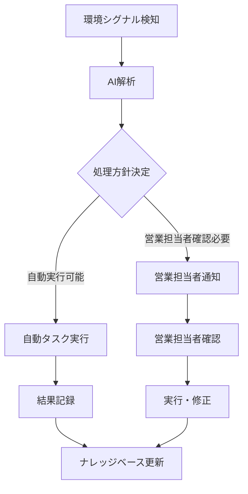

# 営業支援システム統合仕様書

本ドキュメントは、営業支援システムの包括的な統合仕様書です。エージェントインボックスを中心とした設計思想のもと、案件管理、タスク管理、メール管理を統合したシステムの詳細仕様を説明します。

---

## 目次

1. [システムコンセプト](#システムコンセプト)
2. [エージェントインボックス設計](#エージェントインボックス設計)
3. [システム全体設計](#システム全体設計)
4. [統合機能仕様](#統合機能仕様)
5. [ユーザージャーニー統合](#ユーザージャーニー統合)
6. [システム機能要件](#システム機能要件)
7. [非機能要件](#非機能要件)
8. [期待される効果](#期待される効果)

---

## システムコンセプト

### ビジョン
**「営業担当者が顧客との価値創造に集中できる環境」の実現**

営業担当者が事務作業やルーチン業務に時間を取られることなく、顧客との深い関係構築と価値提案に集中できる未来を目指します。

### ミッション
- 営業担当者の業務効率化と生産性向上
- AIによる自動化とインテリジェントな支援
- 顧客満足度の向上と成約率の改善
- 営業プロセスの標準化と品質向上

### エージェントインボックスコンセプト
ユーザーからの直接的な指示だけでなく、環境のシグナル（議事録やメール内容等）に反応し、バックグラウンドでAIエージェント（Sela）が自律的にタスクを実行し、更新アラートを作成する新しいUXを実現します。

#### 実現する機能
- **自律的タスク実行**: 環境シグナルに基づく自動タスク生成・実行
- **エージェントインボックス**: メールの受信箱と顧客サポートのチケットシステムを組み合わせた統合インターフェース
- **全コミュニケーションライン表示**: Selaとユーザー間の全てのやり取りを可視化
- **未解決アクション追跡**: 簡単に未解決のアクションを追跡・管理
- **プロアクティブな支援**: ユーザーが気づく前にSelaが先回りして対応

---

## 統合タイムライン × AI対話設計

### 3ペインレイアウト統合インターフェース

#### 基本設計思想
- **時系列統合ビュー**: メール・案件・タスク・進捗・AI対話を時系列で統合表示
- **3ペインレイアウト**: サイドバー・メインエリア・アクションパネルの効率的な配置
- **AI中心設計**: 時系列の情報を見ながらSelaと自然言語対話
- **プロアクティブ支援**: ユーザーが気づく前の先回り対応

#### 主要コンポーネント

| コンポーネント | 機能 | 詳細 |
|:---|:---|:---|
| **サイドバー** | ダッシュボード・案件一覧・設定の切り替え | ・ダッシュボード・案件一覧・設定<br>・進捗率・リスクアラート・新着通知表示<br>・AI優先スコア順表示 |
| **メインエリア** | 統合タイムライン × AI対話 | ・検索・フィルター<br>・時系列統合表示<br>・AI対話インターフェース<br>・インライン操作・プロアクティブ支援 |
| **アクションパネル** | Selaからの通知・提案・自動実行履歴 | ・Sela通知・提案・アクション<br>・自動実行履歴<br>・設定・カスタマイズ |

### 環境シグナル監視システム

#### 監視対象
- **議事録**: 会議内容からのアクションアイテム抽出
- **メール内容**: 顧客からの要望・質問の自動検知
- **タスク更新**: 進捗状況の変化検知
- **案件ステータス**: 案件の状態変化の監視

#### 自動処理フロー


---

## システム全体設計

### ER図設計

#### 主要エンティティとその関係

| エンティティ名 | 日本語名 | 説明 | 主な関連エンティティ |
|:---|:---|:---|:---|
| Tenant | テナント | サービスを利用する組織やグループの単位 | User, Company |
| User | ユーザー | サービスを利用する個人 | Tenant, Team, Task, Message |
| Team | チーム | ユーザーのグループ | User |
| Company | 企業 | 案件やユーザー、タスクと関連 | Tenant, Opportunity, Task, User |
| Opportunity | 案件 | 企業に紐づくビジネス案件 | Company, Task, Message, Minutes |
| Task | タスク | 案件やユーザー、企業に紐づく作業項目 | Opportunity, User, Company |
| Message | メッセージ | 案件やユーザー、企業に紐づくコミュニケーション | Opportunity, User, Company, Reaction, Minutes |
| Reaction | リアクション | メッセージに対する反応 | Message |
| Minutes | 議事録 | 案件やメッセージに紐づく議事録情報 | Opportunity, Message |

#### サブタイプ
- **Message（メッセージ）**は、用途に応じて以下のサブタイプに分かれます：
  - EmailMessage（電子メール）
  - InternalMessage（社内チャット）
  - BotMessage（チャットボット）

#### 設計方針・特徴
| 特徴・設計方針 | 説明 |
|:---|:---|
| Opportunity に Message が集約される | 案件ごとにやりとり履歴が集約、AI要約や返信文生成の単位になる |
| BotMessage と EmailMessage が統合管理 | チャットもメールも1つのUIで扱える（マルチチャネル設計） |
| Minutes と Reaction の蓄積 | AIエージェントが「過去の議事録＋ユーザーの評価」から学習可能 |
| Task により対応漏れを回避 | AIがメッセージ起点でタスク生成もできる設計に活かせる |

---

## 統合機能仕様

### 1. 案件管理機能

#### 案件ライフサイクル管理
| ステータス | 説明 | 主要機能 |
|:---|:---|:---|
| **見込み** | 初期接触・情報収集段階 | ・企業情報登録<br>・初期タスク作成<br>・AI自動分類 |
| **交渉中** | 商談・提案段階 | ・議事録管理<br>・提案書作成支援<br>・スケジュール調整 |
| **契約** | 契約締結段階 | ・契約書管理<br>・クロージングタスク<br>・顧客移行支援 |
| **クローズ** | 完了・アーカイブ | ・成果記録<br>・ナレッジ蓄積<br>・フォローアップ計画 |

#### 案件自動化機能
- **メール受信時の自動案件作成**: 新しいメールスレッドからの自動案件起票
- **企業別案件分類**: 既存企業との照合による自動分類
- **関連情報統合**: メール・議事録・タスクの自動関連付け

### 2. タスク管理機能

#### タスク生成・管理
| タスクタイプ | 生成方法 | 管理方法 |
|:---|:---|:---|
| **自動生成タスク** | AIによるメール・議事録解析 | ・優先度自動設定<br>・期限自動設定<br>・担当者自動アサイン |
| **手動作成タスク** | 営業担当者による手動作成 | ・テンプレート選択<br>・カスタム設定<br>・関連案件選択 |
| **指示タスク** | マネージャーからの指示 | ・一斉作成<br>・対象フィルター<br>・進捗監視 |

#### AI連携機能
- **自動タスク生成**: AIによるメール・議事録からの自動抽出
- **AI実行依頼**: タスクの自動実行支援
- **進捗自動更新**: 関連アクションからの自動進捗更新

### 3. メール管理機能

#### メール対応方針
| 対応方針 | 適用ケース | AI対応レベル | 営業担当者関与 |
|:---|:---|:---|:---|
| **完全自動対応** | ・製品問い合わせ<br>・申込書不備チェック<br>・リマインドメール | 100%自動 | 通知のみ |
| **AI支援対応** | ・商談内容まとめ<br>・スケジュール調整<br>・新製品紹介 | AI生成 + 営業確認 | 内容確認後送信 |
| **営業担当者対応** | ・複雑な商談<br>・重要な顧客対応<br>・トラブル対応 | AI解析のみ | 営業担当者が対応 |

#### 案件作成の制約事項
- **メッセージベースの案件作成**: メッセージをベースに案件が作られるため、案件から先に作ることはしない
- **Gmail連携**: gmailから最初に顧客に送る時点でAI用のメアドをCCに入れることで案件は作成される
- **将来的な拡張**: システムからメールを送るようになる場合には、案件を先に作る機能が必要

#### 案件内メール作成の制約
- **件名変更による別案件化**: 件名が変われば案件（依頼内容）も変わるため案件内に複数の件名でメールを作成しない
- **設計上の考慮**: 将来的に複数になる可能性もあるので設計上は複数のメールを保持できるようにする
- **案件マージ**: 同様の理由で案件のマージはしない（ただし、将来マージする必要性が出る可能性を設計で考慮する）

#### 自動化ユースケース
- **製品問い合わせ自動回答**: CorporateOnからの回答情報自動取得・送信
- **申込書不備チェック**: 添付ファイルの自動チェック・指摘
- **商談内容まとめ**: 議事録からの自動メール生成
- **スケジュール調整**: 次回打ち合わせ日程の自動調整メール

### 4. マネージャー向け案件管理機能

#### 案件ダッシュボード
- **案件一覧表示**: チームの全案件を一覧で表示
- **フィルター機能**: 担当者・企業・ステータス別のフィルター
- **進捗状況表示**: 案件別の進捗率・リスク表示

#### 通知センター
- **更新通知**: 案件ステータス変更・重要更新の通知
- **更新履歴表示**: 案件の変更履歴を時系列で表示
- **重要度別通知**: 重要度に応じた通知レベル設定

### 5. AIアシスタント機能

#### 対話機能
- **自然言語処理**: 自然言語での質問・指示対応
- **提案機能**: 状況に応じた提案・アドバイス
- **学習機能**: 過去のやり取りからの学習・改善
- **Sela連携**: AIアシスタントSelaとの自然言語対話

#### 自動化機能
- **環境シグナル監視**: 議事録・メール内容の自動解析
- **自動タスク実行**: 設定されたタスクの自動実行
- **システム整合性維持**: データ整合性の自動チェック

### 6. 議事録機能

#### 議事録自動生成機能
- **タスクベース自動生成**: タスク内容から自動的に議事録を生成
- **議事録管理**: 会議内容の記録・管理
- **アクションアイテム抽出**: 議事録からの自動タスク生成
- **参加者管理**: 会議参加者の管理・通知

#### 議事録とタスクの連携
- **タスク→議事録**: タスク実行結果から議事録自動生成
- **議事録→タスク**: 議事録内容からアクションアイテム自動抽出
- **関連付け**: 案件・メール・タスクとの自動関連付け

### 7. 将来拡張機能

#### マネージャー向け案件管理機能
- **案件ダッシュボード**: チーム全体の案件一覧表示
  - **案件一覧表示**: チームの全案件を一覧で表示
  - **フィルター機能**: 担当者・企業・ステータス別のフィルター
  - **進捗状況表示**: 案件別の進捗率・リスク表示
- **通知センター**: 案件更新の通知・履歴管理
  - **更新通知**: 案件ステータス変更・重要更新の通知
  - **更新履歴表示**: 案件の変更履歴を時系列で表示
  - **重要度別通知**: 重要度に応じた通知レベル設定

#### Slack連携機能（将来拡張）
- **Slack通知**: 重要な更新のSlack通知
- **Slack連携**: Slackでのタスク作成・更新
- **チャット統合**: Slackチャットの統合表示

#### プロジェクト管理機能（将来拡張）
- **プロジェクト作成・管理**: 複数案件を統合したプロジェクト管理
- **マイルストーン管理**: プロジェクトのマイルストーン設定・管理
- **リソース管理**: 人員・予算の管理

#### クロージング計画日設定機能（将来拡張）
- **クロージング計画**: 案件のクロージング計画日設定
- **進捗管理**: クロージングに向けた進捗管理
- **アラート機能**: クロージング期限のアラート

#### アラート機能
- **期限切れ・遅延の自動通知**: 期限切れ・遅延タスクの自動通知
- **AI実行依頼**: タスクの自動実行支援
- **メール通知機能**: 本日が期限・期限切れタスクのメール通知
  - **通知対象**: 期限当日・期限切れのタスク
  - **通知内容**: タスク名・期限・優先度・関連案件情報
  - **通知タイミング**: 朝の業務開始前・期限当日の朝
  - **通知方法**: メール通知・システム内アラート

---

## システム機能要件

### 1. エージェントインボックス機能

#### 統合コミュニケーション管理
- **全コミュニケーションライン表示**: メール・チャット・議事録の統合表示
- **時系列表示**: 全てのやり取りを時系列で表示
- **検索・フィルター機能**: 条件別の情報抽出
- **関連情報表示**: 案件・タスクとの関連性表示

#### アクション追跡機能
- **未解決アクション一覧**: 期限・優先度別のアクション管理
- **進捗状況追跡**: リアルタイムでの進捗更新
- **アラート機能**: 期限切れ・遅延の自動通知
- **AI実行依頼**: タスクの自動実行支援

#### 環境シグナル監視機能
- **自動検知**: 議事録・メール内容の自動解析
- **タスク自動生成**: 検知されたシグナルからの自動タスク作成
- **アラート通知**: 重要なシグナルの自動通知
- **設定管理**: 監視条件のカスタマイズ

### 2. 案件管理機能

#### 案件ライフサイクル管理
- **案件作成**: 自動・手動による案件作成（メッセージベース）
- **ステータス管理**: 見込み→交渉中→契約→クローズの管理
- **関連情報統合**: メール・議事録・タスクの自動関連付け
- **進捗可視化**: 案件別の進捗状況表示

#### 案件自動化機能
- **メールからの自動案件作成**: 新規メールスレッドからの自動起票
- **企業別分類**: 既存企業との自動照合・分類
- **重複検知**: 類似案件の自動検知・統合提案

### 3. タスク管理機能

#### タスク生成・管理
- **自動タスク生成**: AIによるメール・議事録からの自動抽出
- **手動タスク作成**: 営業担当者による手動作成
- **一斉タスク作成**: マネージャーによる一斉指示
- **進捗管理**: ステータス・進捗の管理

#### AI連携機能
- **AI実行依頼**: タスクの自動実行支援
- **提案機能**: AIによるタスク内容提案
- **自動更新**: 関連アクションからの自動進捗更新

### 4. メール管理機能

#### メール対応自動化
- **自動応答**: 製品問い合わせ・申込書チェックの自動対応
- **AI支援作成**: 商談内容まとめ・スケジュール調整の支援
- **案件関連付け**: メールと案件の自動関連付け
- **優先度判定**: AIによる重要度・緊急度の自動判定

#### メール閲覧・管理
- **統合表示**: メール・チャット・議事録の統合表示
- **検索機能**: 条件別のメール検索
- **権限管理**: 役職別の閲覧権限制御

### 5. AIアシスタント機能

#### 対話機能
- **自然言語処理**: 自然言語での質問・指示対応
- **提案機能**: 状況に応じた提案・アドバイス
- **学習機能**: 過去のやり取りからの学習・改善
- **Sela連携**: AIアシスタントSelaとの自然言語対話

#### 自動化機能
- **環境シグナル監視**: 議事録・メール内容の自動解析
- **自動タスク実行**: 設定されたタスクの自動実行
- **システム整合性維持**: データ整合性の自動チェック

### 6. 議事録機能

#### 議事録自動生成機能
- **タスクベース自動生成**: タスク内容から自動的に議事録を生成
- **議事録管理**: 会議内容の記録・管理
- **アクションアイテム抽出**: 議事録からの自動タスク生成
- **参加者管理**: 会議参加者の管理・通知

#### 議事録とタスクの連携
- **タスク→議事録**: タスク実行結果から議事録自動生成
- **議事録→タスク**: 議事録内容からアクションアイテム自動抽出
- **関連付け**: 案件・メール・タスクとの自動関連付け

### 7. 将来拡張機能

#### マネージャー向け案件管理機能
- **案件ダッシュボード**: チーム全体の案件一覧表示
  - **案件一覧表示**: チームの全案件を一覧で表示
  - **フィルター機能**: 担当者・企業・ステータス別のフィルター
  - **進捗状況表示**: 案件別の進捗率・リスク表示
- **通知センター**: 案件更新の通知・履歴管理
  - **更新通知**: 案件ステータス変更・重要更新の通知
  - **更新履歴表示**: 案件の変更履歴を時系列で表示
  - **重要度別通知**: 重要度に応じた通知レベル設定

#### Slack連携機能（将来拡張）
- **Slack通知**: 重要な更新のSlack通知
- **Slack連携**: Slackでのタスク作成・更新
- **チャット統合**: Slackチャットの統合表示

#### プロジェクト管理機能（将来拡張）
- **プロジェクト作成・管理**: 複数案件を統合したプロジェクト管理
- **マイルストーン管理**: プロジェクトのマイルストーン設定・管理
- **リソース管理**: 人員・予算の管理

#### クロージング計画日設定機能（将来拡張）
- **クロージング計画**: 案件のクロージング計画日設定
- **進捗管理**: クロージングに向けた進捗管理
- **アラート機能**: クロージング期限のアラート

#### アラート機能
- **期限切れ・遅延の自動通知**: 期限切れ・遅延タスクの自動通知
- **AI実行依頼**: タスクの自動実行支援
- **メール通知機能**: 本日が期限・期限切れタスクのメール通知
  - **通知対象**: 期限当日・期限切れのタスク
  - **通知内容**: タスク名・期限・優先度・関連案件情報
  - **通知タイミング**: 朝の業務開始前・期限当日の朝
  - **通知方法**: メール通知・システム内アラート

---

## 非機能要件

### 1. パフォーマンス要件
- **レスポンス時間**: 画面表示3秒以内、検索結果表示1秒以内
- **同時接続数**: 1000ユーザー同時接続対応
- **データ処理**: 大量データの高速処理対応

### 2. セキュリティ要件
- **認証・認可**: 多要素認証、細かい権限管理
- **データ保護**: 暗号化通信、データ暗号化
- **監査ログ**: 操作履歴の記録・監査

### 3. 可用性要件
- **稼働率**: 99.9%以上の稼働率
- **バックアップ**: 日次バックアップ、災害復旧対応
- **スケーラビリティ**: 水平スケーリング対応

### 4. 運用要件
- **監視**: システム監視、アラート機能
- **ログ管理**: 操作ログ、エラーログの管理
- **メンテナンス**: 定期メンテナンス、アップデート対応

---

## 期待される効果

### 営業担当者向け
- **業務効率の大幅向上**: 自動化による作業時間50%削減
- **認知負荷の軽減**: エージェントインボックスによる情報整理
- **直感的な操作体験**: 統合インターフェースによる使いやすさ
- **対応漏れの防止**: AIによる自動検知・通知

### マネージャー向け
- **効率的なチーム管理**: リアルタイムでの進捗把握
- **データに基づく意思決定**: 分析結果による戦略立案
- **早期問題発見**: リスクアラートによる早期対応

### 組織向け
- **営業生産性の向上**: 効率化による売上増加
- **顧客満足度の向上**: 迅速・適切な対応
- **競合優位性の確保**: 差別化された営業支援システム
- **組織的学習の促進**: ナレッジ蓄積・共有

### 顧客向け
- **24時間対応**: AIによる自動応答
- **一貫性のあるサービス**: 標準化された対応品質
- **迅速な対応**: 自動化による即座の対応
- **パーソナライズされた提案**: AIによる個別最適化

---

## 関連ドキュメント

- [エージェントインボックス仕様書.md](./エージェントインボックス仕様書.md) - エージェントインボックスの詳細仕様
- [システム設計書.md](./システム設計書.md) - システム全体の技術設計
- [画面設計書.md](./画面設計書.md) - 画面設計の詳細仕様

## システム設計の基本方針

### 設計原則

#### 1. エージェントインボックス中心設計
- **統合インターフェース**: 全てのコミュニケーションとアクションを一元表示
- **プロアクティブな支援**: ユーザーが気づく前にAIが先回りして対応
- **直感的な操作**: 自然言語での質問・指示に対応
- **環境シグナル監視**: 議事録・メール内容の自動解析・検知

#### 2. PCデスクトップ最適化
- **デスクトップ**: 3ペインレイアウトで詳細表示
- **マルチモニター対応**: 複数画面での効率的な操作
- **キーボード・マウス操作**: デスクトップ環境に最適化された操作

#### 3. アクセシビリティ対応
- **キーボードナビゲーション**: 全操作をキーボードで実行可能
- **スクリーンリーダー対応**: 音声読み上げでの操作支援
- **色覚異常対応**: 色以外での情報提供

#### 4. パンクズリスト（パンくずリスト）表示ルール
- **全画面必須表示**: 全ての詳細画面・編集画面でパンクズリストを必ず表示
- **階層構造表示**: 「案件名 > タスク名」「案件名 > メール詳細」などの階層を明示
- **現在位置の明確化**: ユーザーが現在どの画面にいるかを常に明示
- **ナビゲーション支援**: 上位階層への戻りやすさを確保
- **一貫性の維持**: 全画面で統一されたパンクズリスト表示形式を採用

### パンクズリスト表示ガイドライン

#### 表示形式例
```
ホーム > 案件管理 > A社案件 > タスク詳細
ホーム > タスク管理 > 高優先度タスク > 編集
ホーム > メール管理 > 受信メール > 返信
ホーム > AIアシスタント > 対話履歴 > 詳細
```

#### 実装要件
| 項目 | 詳細 | 実装方法 |
|:---|:---|:---|
| **必須表示画面** | 全ての詳細・編集画面 | ・案件詳細画面<br>・タスク詳細画面<br>・メール詳細画面<br>・編集画面<br>・AI対話詳細画面 |
| **階層構造** | 論理的な階層表示 | ・案件名 > タスク名<br>・案件名 > メール詳細<br>・カテゴリ > 詳細 |
| **クリック可能** | 上位階層への移動 | ・各階層をクリック可能<br>・ホバー効果<br>・現在位置は非クリック |
| **レスポンシブ対応** | 画面サイズに応じた表示 | ・長い階層は省略表示<br>・モバイル対応<br>・ツールチップ表示 | 