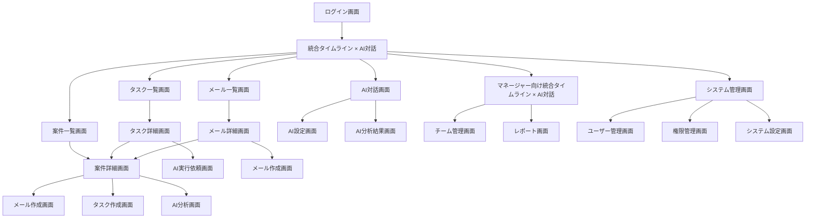

# 画面設計書

本ドキュメントは、営業支援システムの画面設計の詳細仕様を説明します。エージェントインボックスを中心とした統合インターフェースと、各機能画面の詳細設計を含みます。

---

## 目次

1. [画面設計の基本方針](#画面設計の基本方針)
2. [エージェントインボックス画面](#エージェントインボックス画面)
3. [共通画面](#共通画面)
4. [営業担当者向け画面](#営業担当者向け画面)
5. [マネージャー向け画面](#マネージャー向け画面)
6. [AIアシスタント向け画面](#aiアシスタント向け画面)
7. [システム管理画面](#システム管理画面)
8. [PCデスクトップ最適化機能](#pcデスクトップ最適化機能)
9. [画面遷移設計](#画面遷移設計)
10. [UX設計ガイドライン](#ux設計ガイドライン)

---

## 画面設計の基本方針

### 設計原則

#### 1. アンビエントエージェント中心設計
- **4要素統合表示**: 状況確認・次のアクション・承認・確認・補完の4要素を常に表示
- **プロアクティブな支援**: ユーザーが気づく前にAIが先回りして対応
- **直感的な操作**: 自然言語での質問・指示に対応
- **環境シグナル監視**: 議事録・メール内容の自動解析・検知

#### 2. 4エリア基本レイアウト
- **状況確認エリア**: 現在の業務状況の透明性を確保
- **次のアクションエリア**: 優先度別アクションを明確に提示
- **承認・確認エリア**: 人間による最終判断を確保
- **補完・リスク管理エリア**: 見逃しリスクの検知と改善提案

#### 3. PCデスクトップ最適化
- **デスクトップ**: 4エリアレイアウトで詳細表示
- **マルチモニター対応**: 複数画面での効率的な操作
- **キーボード・マウス操作**: デスクトップ環境に最適化された操作

#### 4. アクセシビリティ対応
- **キーボードナビゲーション**: 全操作をキーボードで実行可能
- **スクリーンリーダー対応**: 音声読み上げでの操作支援
- **色覚異常対応**: 色以外での情報提供

#### 5. パンクズリスト（パンくずリスト）表示ルール
- **全画面必須表示**: 全ての詳細画面・編集画面でパンクズリストを必ず表示
- **階層構造表示**: 「案件名 > タスク名」「案件名 > メール詳細」などの階層を明示
- **現在位置の明確化**: ユーザーが現在どの画面にいるかを常に明示
- **ナビゲーション支援**: 上位階層への戻りやすさを確保
- **一貫性の維持**: 全画面で統一されたパンクズリスト表示形式を採用

### 4エリア設計ガイドライン

#### 基本レイアウト構成
```
┌─────────────────────────────────────────────────────────────┐
│                   ヘッダー・ナビゲーション                    │
├─────────────────────────────────────────────────────────────┤
│                    状況確認エリア                           │
│  📊 今日の進捗: 5/8タスク完了  📧 未読メール: 3件          │
│  ⚠️  リスク案件: A社（期限切れ）  💰 受注見込み: 500万円     │
├─────────────────────────────────────────────────────────────┤
│                    次のアクション                           │
│  🔥 優先: A社への緊急連絡（期限: 今日17時）               │
│  📋 次点: B社提案書作成（期限: 明日）                     │
│  📞 予定: C社フォローアップ（期限: 今週中）               │
├─────────────────────────────────────────────────────────────┤
│                    承認・確認エリア                         │
│  ✅ 承認待ち: 議事録自動生成（3件）                       │
│  ⏳ 確認中: 見積書（D社）                                 │
│  📋 レビュー: 提案書（E社）                               │
├─────────────────────────────────────────────────────────────┤
│                    補完・リスク管理                         │
│  🔍 見逃しリスク: F社のフォローアップ（3日未連絡）         │
│  💡 改善提案: 成約率向上のため商談頻度を増加              │
│  ⚡ 自動実行: 明日のスケジュール調整完了                   │
└─────────────────────────────────────────────────────────────┘
```

#### 各エリアの設計原則

| エリア | 設計原則 | 実装方針 |
|:---|:---|:---|
| **状況確認** | 透明性・即座の理解 | ・視覚的な進捗表示<br>・数値による明確な指標<br>・色分けによる重要度表示 |
| **次のアクション** | 明確性・実行可能性 | ・優先度別の明確な分類<br>・期限の明確な表示<br>・ワンクリック実行機能 |
| **承認・確認** | 安全性・品質保証 | ・プレビュー機能<br>・承認/拒否の明確な操作<br>・履歴記録機能 |
| **補完・リスク管理** | 予防性・改善性 | ・リスク検知の自動化<br>・改善提案の提示<br>・自動実行の状況表示 |

### パンクズリスト表示ガイドライン

#### 表示形式
```
ホーム > 案件管理 > A社案件 > タスク詳細
ホーム > タスク管理 > 高優先度タスク > 編集
ホーム > メール管理 > 受信メール > 返信
```

#### 実装ルール
| 項目 | 詳細 | 実装方法 |
|:---|:---|:---|
| **必須表示画面** | 全ての詳細・編集画面 | ・案件詳細画面<br>・タスク詳細画面<br>・メール詳細画面<br>・編集画面 |
| **階層構造** | 論理的な階層表示 | ・案件名 > タスク名<br>・案件名 > メール詳細<br>・カテゴリ > 詳細 |
| **クリック可能** | 上位階層への移動 | ・各階層をクリック可能<br>・ホバー効果<br>・現在位置は非クリック |
| **レスポンシブ対応** | 画面サイズに応じた表示 | ・長い階層は省略表示<br>・モバイル対応<br>・ツールチップ表示 |

### デザインシステム

#### 1. カラーパレット
| 色 | 用途 | 16進値 |
|:---|:---|:---|
| **Primary Blue** | メインカラー | #2563EB |
| **Secondary Gray** | サブカラー | #6B7280 |
| **Success Green** | 成功・完了 | #10B981 |
| **Warning Orange** | 警告・注意 | #F59E0B |
| **Error Red** | エラー・危険 | #EF4444 |
| **Background** | 背景色 | #F9FAFB |
| **Surface** | 表面色 | #FFFFFF |

#### 2. タイポグラフィ
| 要素 | フォントサイズ | フォントウェイト | 用途 |
|:---|:---|:---|:---|
| **Heading 1** | 32px | Bold | ページタイトル |
| **Heading 2** | 24px | SemiBold | セクションタイトル |
| **Heading 3** | 20px | Medium | サブセクション |
| **Body Large** | 16px | Regular | 本文（重要） |
| **Body Medium** | 14px | Regular | 本文（標準） |
| **Body Small** | 12px | Regular | 補足情報 |

#### 3. コンポーネント設計
| コンポーネント | 用途 | 特徴 |
|:---|:---|:---|
| **Button** | アクション実行 | ・Primary/Secondary/Text<br>・Loading状態<br>・Disabled状態 |
| **Input** | データ入力 | ・Text/Email/Password<br>・Validation表示<br>・AutoComplete |
| **Card** | 情報表示 | ・Elevation<br>・Hover効果<br>・Action表示 |
| **Modal** | 詳細表示 | ・Backdrop<br>・Close機能<br>・Responsive対応 |

---

## エージェントインボックス画面

### メイン画面レイアウト

#### 3ペインレイアウト設計
```
┌─────────────────────────────────────────────────────────┐
│                    ヘッダー                            │
│  [ロゴ] [検索] [通知] [プロフィール] [設定]            │
├─────────────┬─────────────────────┬───────────────────┤
│  サイドバー  │      メインエリア    │    アクションパネル  │
│             │                     │                   │
│ • フィルター │ • 統合タイムライン   │ • 未解決アクション   │
│ • 検索      │ • コミュニケーション │ • AI提案          │
│ • 案件一覧  │ • メール・チャット   │ • クイックアクション │
│ • タスク    │ • 議事録│                   │
│ • 設定      │                     │                   │
└─────────────┴─────────────────────┴───────────────────┘
```

#### PCデスクトップ最適化
| 機能 | 詳細 | 特徴 |
|:---|:---|:---|
| **3ペインレイアウト** | サイドバー・メインエリア・アクションパネル | ・詳細表示<br>・一括操作<br>・高度なフィルター |
| **マルチモニター対応** | 複数画面での効率的な操作 | ・画面分割対応<br>・ドラッグ&ドロップ<br>・ウィンドウ管理 |
| **キーボード・マウス操作** | デスクトップ環境に最適化 | ・ショートカットキー<br>・右クリックメニュー<br>・ホバー効果 |

### 主要コンポーネント

#### 1. 統合タイムライン
| 要素 | 詳細 | 実装 |
|:---|:---|:---|
| **時系列表示** | 全てのコミュニケーションを時系列で表示 | ・メール・チャット・議事録<br>・タスク更新・ステータス変更<br>・AI実行結果 |
| **関連性表示** | 案件・タスクとの関連性を可視化 | ・関連案件へのリンク<br>・関連タスクの表示<br>・影響範囲の表示 |
| **フィルター機能** | 条件別の表示制御 | ・日付範囲・案件別<br>・重要度・ステータス別<br>・送信者・受信者別 |

#### 2. コミュニケーション統合表示
| タイプ | 表示方法 | 統合機能 |
|:---|:---|:---|
| **メール** | スレッド形式 | ・返信・転送<br>・案件関連付け<br>・AI提案表示 |
| **チャット** | リアルタイム表示 | ・即座の返信<br>・ファイル共有<br>・AI対話 |
| **議事録** | 構造化表示 | ・アクションアイテム抽出<br>・参加者表示<br>・決定事項ハイライト |

#### 3. アクション追跡パネル
| 機能 | 詳細 | 実装 |
|:---|:---|:---|
| **未解決アクション** | 期限・優先度別のアクション一覧 | ・期限別表示<br>・優先度別表示<br>・担当者別表示 |
| **AI提案** | 状況に応じた提案表示 | ・次アクション提案<br>・最適化提案<br>・リスク対策提案 |
| **クイックアクション** | よく使う操作のショートカット | ・タスク作成<br>・メール送信<br>・案件更新 |

### AI対話インターフェース

#### チャットUI設計
| 要素 | 詳細 | 実装 |
|:---|:---|:---|
| **メッセージ表示** | ユーザー・AIの対話表示 | ・バブル形式表示<br>・タイムスタンプ表示<br>・ステータス表示 |
| **入力エリア** | 自然言語入力 | ・テキスト入力<br>・音声入力対応<br>・絵文字・ファイル対応 |
| **提案表示** | AI提案の表示 | ・クイックアクション<br>・提案ボタン<br>・詳細表示 |

#### 対話機能
| 機能 | 詳細 | 実装 |
|:---|:---|:---|
| **状況確認** | 「今日のタスク教えて」など | ・タスク一覧表示<br>・優先度表示<br>・進捗状況表示 |
| **情報検索** | 「A社の案件状況は？」など | ・案件情報表示<br>・関連情報表示<br>・履歴表示 |
| **指示実行** | 「明日までにA社に連絡して」など | ・タスク自動生成<br>・メール自動生成<br>・スケジュール調整 |

---

## 共通画面

### 1. ログイン・認証画面

#### ログイン画面
| 要素 | 詳細 | 実装 |
|:---|:---|:---|
| **ロゴ・ブランディング** | 企業ロゴ・システム名表示 | ・レスポンシブ対応<br>・ダークモード対応 |
| **ログインフォーム** | ユーザーID・パスワード入力 | ・バリデーション<br>・エラー表示<br>・AutoComplete |
| **多要素認証** | 2FA対応 | ・SMS認証<br>・アプリ認証<br>・ハードウェア認証 |
| **パスワードリセット** | パスワード再設定リンク | ・メール送信<br>・セキュリティ確認 |

#### パスワードリセット画面
| 要素 | 詳細 | 実装 |
|:---|:---|:---|
| **メールアドレス入力** | リセット対象のメールアドレス | ・バリデーション<br>・存在確認 |
| **認証コード入力** | 送信された認証コード | ・6桁数字<br>・タイムアウト処理 |
| **新パスワード設定** | 新しいパスワード入力 | ・強度チェック<br>・確認入力 |

### 2. 統合タイムライン × AI対話画面

#### 3ペインレイアウト構成
```
┌─────────────────────────────────────────────────────────────┐
│                   ヘッダー・ナビゲーション                    │
├─────────────┬─────────────────────────────┬───────────────┤
│             │                             │               │
│   サイドバー   │      統合タイムライン × AI対話      │  アクションパネル  │
│             │                             │               │
│ ・ダッシュボード│  ・検索・フィルター          │ ・Sela通知      │
│ ・案件一覧    │  ・時系列統合表示          │ ・提案・アクション  │
│ ・設定        │  ・AI対話インターフェース   │ ・自動実行履歴    │
│             │  ・インライン操作          │ ・設定・カスタマイズ│
│             │  ・プロアクティブ支援        │               │
│             │                             │               │
└─────────────┴─────────────────────────────┴───────────────┘
```

#### サイドバー機能
| セクション | 内容 | 実装 |
|:---|:---|:---|
| **ダッシュボード** | 統合サマリー表示 | ・今日の優先事項<br>・リスクアラート<br>・AI提案<br>・KPI指標 |
| **案件一覧** | 担当案件の一覧 | ・ステータス別表示<br>・進捗率表示<br>・リスクアラート<br>・新着・更新通知 |
| **設定** | 個人・システム設定 | ・通知設定<br>・表示設定<br>・AI設定<br>・セキュリティ設定 |

#### メインエリア：統合タイムライン × AI対話機能
| セクション | 内容 | 実装 |
|:---|:---|:---|
| **検索・フィルター** | 全情報の検索・絞り込み | ・キーワード検索<br>・期間フィルター<br>・種類フィルター<br>・重要度フィルター<br>・案件フィルター |
| **時系列統合表示** | メール・案件・タスク・進捗・AI対話の時系列表示 | ・時系列統合表示<br>・案件別グループ化<br>・重要度・緊急度表示 |
| **AI対話インターフェース** | 時系列の情報を見ながらSelaと対話 | ・自然言語入力<br>・コンテキスト理解<br>・インライン操作<br>・プロアクティブ支援 |
| **インライン操作** | タイムライン内での直接編集・実行 | ・直接編集<br>・AI提案承認<br>・コンテキスト操作 |

#### アクションパネル機能
| セクション | 内容 | 実装 |
|:---|:---|:---|
| **Sela通知** | AIからの重要通知 | ・アラート表示<br>・重要度別色分け<br>・アクション提案<br>・時系列での通知表示 |
| **提案・アクション** | Selaからの提案 | ・次アクション提案<br>・最適化提案<br>・リスク対策提案<br>・時系列に基づく提案 |
| **自動実行履歴** | AIの自動実行記録 | ・実行ログ表示<br>・結果表示<br>・再実行機能<br>・時系列での実行履歴 |
| **設定・カスタマイズ** | 個人設定 | ・通知設定<br>・表示設定<br>・AI設定<br>・時系列表示設定 |

#### ダッシュボード統合機能
| セクション | 内容 | 実装 |
|:---|:---|:---|
| **今日の優先事項** | AI優先顧客リスト・今日のタスク | ・最新10件表示<br>・優先度表示<br>・進捗状況 |
| **リスクアラート** | 期限切れ・遅延タスク | ・アラート表示<br>・緊急度別色分け<br>・アクション提案 |
| **重要メール通知** | 未読・重要メール | ・件名表示<br>・送信者表示<br>・重要度表示 |
| **AI提案** | 状況に応じた提案 | ・次アクション提案<br>・最適化提案<br>・リスク対策提案 |
| **夜の業務確認** | 翌日計画・今日の成果確認 | ・翌日スケジュール表示<br>・今日の成果サマリー<br>・メンバー成果確認 |

---

## 営業担当者向け画面

### 1. 案件管理画面群

#### 案件一覧画面
| 機能 | 詳細 | 実装 |
|:---|:---|:---|
| **検索・フィルター** | 企業名・キーワード・ステータス | ・リアルタイム検索<br>・複数条件フィルター<br>・保存検索 |
| **新着案件表示** | 最新の案件を上位表示 | ・NEWマーク<br>・更新日時表示<br>・優先度表示 |
| **ステータス別表示** | 見込み・交渉中・契約・クローズ | ・色分け表示<br>・進捗率表示<br>・次アクション表示 |
| **一括操作** | 複数案件の同時操作 | ・ステータス変更<br>・担当者変更<br>・エクスポート |

#### 案件詳細画面
| セクション | 内容 | 実装 |
|:---|:---|:---|
| **基本情報** | 企業・担当者・ステータス | ・編集可能<br>・履歴表示<br>・関連情報表示 |
| **やり取り履歴** | メール・議事録・タスクの時系列 | ・統合タイムライン<br>・検索・フィルター<br>・詳細表示 |
| **関連タスク一覧** | 案件に紐づくタスク | ・ステータス別表示<br>・期限表示<br>・進捗状況 |
| **関連ファイル一覧** | 添付ファイル・ドキュメント | ・プレビュー機能<br>・ダウンロード<br>・バージョン管理 |

#### 案件検索画面
| 機能 | 詳細 | 実装 |
|:---|:---|:---|
| **検索条件入力** | 企業名・キーワード・詳細条件 | ・AutoComplete<br>・検索候補表示<br>・条件保存 |
| **検索結果一覧** | 条件に合致する案件 | ・ページネーション<br>・ソート機能<br>・詳細表示 |
| **検索履歴** | 過去の検索条件 | ・履歴表示<br>・再利用機能<br>・削除機能 |

#### 案件作成画面
| セクション | 内容 | 実装 |
|:---|:---|:---|
| **企業情報入力** | 企業名・業界・規模 | ・AutoComplete<br>・既存企業照合<br>・新規企業登録 |
| **案件概要入力** | 案件名・概要・価値 | ・テンプレート選択<br>・AI支援入力<br>・バリデーション |
| **担当者設定** | 担当者・チーム設定 | ・ユーザー選択<br>・権限設定<br>・通知設定 |
| **初期ステータス設定** | 見込み・交渉中など | ・ステータス選択<br>・初期タスク作成<br>・スケジュール設定 |

### 2. タスク管理画面群

#### タスク一覧画面
| 機能 | 詳細 | 実装 |
|:---|:---|:---|
| **タスク一覧表示** | 担当タスクの一覧 | ・期限別表示<br>・優先度表示<br>・進捗状況表示 |
| **期限別フィルター** | 今日・今週・期限切れ | ・タブ切り替え<br>・カウント表示<br>・アラート表示 |
| **優先度表示** | 高・中・低の優先度 | ・色分け表示<br>・アイコン表示<br>・ソート機能 |
| **進捗状況管理** | 未着手・進行中・完了 | ・ステータス変更<br>・進捗率表示<br>・完了日時記録 |

#### タスク詳細画面
| セクション | 内容 | 実装 |
|:---|:---|:---|
| **タスク基本情報** | タイトル・概要・期限・優先度 | ・編集機能<br>・履歴表示<br>・関連情報表示 |
| **コメント履歴** | タスクに関するコメント | ・時系列表示<br>・ユーザー表示<br>・ファイル添付 |
| **関連案件情報** | タスクの背景・関連案件 | ・案件詳細表示<br>・関連タスク表示<br>・影響範囲表示 |
| **AI実行結果** | AIによる自動実行結果 | ・実行ログ表示<br>・結果表示<br>・再実行機能 |

#### タスク作成画面
| セクション | 内容 | 実装 |
|:---|:---|:---|
| **タスク情報入力** | タイトル・概要・期限 | ・テンプレート選択<br>・AI支援入力<br>・バリデーション |
| **担当者選択** | タスクの担当者設定 | ・ユーザー選択<br>・チーム選択<br>・権限設定 |
| **期限設定** | 開始日・期限日・リマインダー | ・カレンダー選択<br>・自動計算<br>・通知設定 |
| **優先度設定** | 高・中・低の優先度 | ・ラジオボタン<br>・色分け表示<br>・説明表示 |

### 3. メール管理画面群

#### メール一覧画面
| 機能 | 詳細 | 実装 |
|:---|:---|:---|
| **メール一覧表示** | 受信・送信メールの一覧 | ・未読・既読表示<br>・重要度表示<br>・添付ファイル表示 |
| **重要度別フィルター** | 高・中・低の重要度 | ・色分け表示<br>・アイコン表示<br>・フィルター機能 |
| **AI優先スコア順表示** | AI解析による優先度 | ・スコア表示<br>・自動ソート<br>・説明表示 |
| **未読・既読管理** | メールの読了状況 | ・未読カウント<br>・一括既読<br>・自動既読設定 |

#### メール詳細画面
| セクション | 内容 | 実装 |
|:---|:---|:---|
| **メール内容表示** | 本文・添付ファイル・送信者 | ・HTML表示<br>・プレーンテキスト表示<br>・添付ファイル表示 |
| **スレッド表示** | メールのやり取り履歴 | ・時系列表示<br>・返信・転送表示<br>・関連メール表示 |
| **AI解析結果表示** | AIによる内容解析 | ・重要度判定<br>・感情分析<br>・アクション提案 |
| **関連情報表示** | 案件・タスクとの関連 | ・関連案件表示<br>・関連タスク表示<br>・影響範囲表示 |

#### メール作成画面
| セクション | 内容 | 実装 |
|:---|:---|:---|
| **宛先・件名入力** | 宛先・CC・BCC・件名 | ・AutoComplete<br>・バリデーション<br>・テンプレート選択 |
| **本文入力** | メール本文の作成 | ・リッチテキストエディタ<br>・AI支援作成<br>・テンプレート適用 |
| **添付ファイル** | ファイルの添付・管理 | ・ドラッグ&ドロップ<br>・プレビュー機能<br>・サイズ制限 |
| **AI提案内容** | AIによる提案・支援 | ・提案表示<br>・適用機能<br>・カスタマイズ機能 |

### 4. AIアシスタント画面群

#### AI対話画面
| 機能 | 詳細 | 実装 |
|:---|:---|:---|
| **チャットインターフェース** | Selaとの対話機能 | ・メッセージ表示<br>・入力エリア<br>・送信ボタン |
| **自然言語入力** | 自然言語での質問・指示 | ・テキスト入力<br>・音声入力<br>・絵文字対応 |
| **AI提案表示** | Selaによる提案・アドバイス | ・提案表示<br>・詳細説明<br>・実行ボタン |
| **実行依頼** | Selaへのタスク実行依頼 | ・実行確認<br>・進捗表示<br>・結果表示 |

#### AI分析画面
| セクション | 内容 | 実装 |
|:---|:---|:---|
| **解析結果グラフ** | データの可視化 | ・グラフ表示<br>・期間選択<br>・フィルター機能 |
| **成功パターン** | 成功事例の分析 | ・パターン表示<br>・詳細分析<br>・適用提案 |
| **リスク分析** | リスクの特定・分析 | ・リスク指標表示<br>・警告表示<br>・対策提案 |
| **改善提案** | 改善点の提案 | ・提案表示<br>・優先度表示<br>・実行計画 |

---

## マネージャー向け画面

### 1. マネージャー向け統合エージェントインボックス

#### マネージャー専用サイドバー機能
| セクション | 内容 | 実装 |
|:---|:---|:---|
| **チーム案件一覧** | 部下の担当案件一覧 | ・担当者別表示<br>・進捗率表示<br>・リスクアラート |
| **チームタスク一覧** | 部下の担当タスク一覧 | ・担当者別表示<br>・期限別表示<br>・進捗状況表示 |
| **チームメール一覧** | 部下の重要メール一覧 | ・担当者別表示<br>・重要度表示<br>・AI優先スコア順 |
| **マネージャーダッシュボード** | チーム統合サマリー表示 | ・チーム進捗サマリー<br>・リスク案件一覧<br>・KPI指標 |

#### マネージャー専用メインエリア機能
| セクション | 内容 | 実装 |
|:---|:---|:---|
| **チーム統合タイムライン** | チーム全体の活動を時系列で表示 | ・チーム活動統合表示<br>・担当者別フィルター<br>・重要度別表示 |
| **Sela対話インターフェース** | チーム管理のためのSela対話 | ・チーム状況質問<br>・部下サポート提案<br>・KPI分析要求 |
| **部下詳細表示** | 選択した部下の詳細情報 | ・部下基本情報<br>・担当案件・タスク<br>・活動履歴・成果 |

#### マネージャー専用アクションパネル機能
| セクション | 内容 | 実装 |
|:---|:---|:---|
| **チームSela通知** | チーム全体の重要通知 | ・チームリスクアラート<br>・部下サポート要請<br>・KPI警告 |
| **チーム提案・アクション** | チーム改善のための提案 | ・チーム改善提案<br>・部下サポート提案<br>・リスク対策提案 |
| **チーム自動実行履歴** | チーム管理の自動実行記録 | ・チーム分析実行<br>・部下サポート実行<br>・KPI分析実行 |
| **マネージャー設定** | チーム管理設定 | ・チーム通知設定<br>・KPI目標設定<br>・部下サポート設定 |

### 2. マネージャーダッシュボード統合機能

| セクション | 内容 | 実装 |
|:---|:---|:---|
| **チーム進捗サマリー** | チーム全体の進捗状況 | ・進捗率表示<br>・目標対比<br>・トレンド表示 |
| **リスク案件一覧** | リスクの高い案件 | ・リスクレベル表示<br>・詳細情報<br>・アクション提案 |
| **部下別活動状況** | 部下の活動・成果 | ・活動履歴<br>・成果表示<br>・サポート提案 |
| **売上・成約率指標** | KPI指標の表示 | ・グラフ表示<br>・期間比較<br>・目標対比 |

### 3. 通知センター統合

| セクション | 内容 | 実装 |
|:---|:---|:---|
| **チーム更新通知一覧** | チーム全体の重要更新通知 | ・通知タイプ表示<br>・重要度表示<br>・時刻表示 |
| **チーム更新履歴表示** | チーム全体の変更履歴 | ・変更内容表示<br>・変更者表示<br>・変更日時表示 |
| **重要度別通知** | 重要度に応じた通知レベル設定 | ・通知レベル設定<br>・フィルター機能<br>・既読管理 |
| **チーム通知設定** | チーム管理の通知設定 | ・通知項目選択<br>・通知方法選択<br>・通知頻度設定 |

### 4. チーム管理画面

#### チーム一覧画面
| 機能 | 詳細 | 実装 |
|:---|:---|:---|
| **部下の一覧表示** | チームメンバーの一覧 | ・基本情報表示<br>・進捗状況<br>・成果表示 |
| **進捗状況把握** | 部下の進捗・リスク | ・進捗率表示<br>・リスクアラート<br>・詳細表示 |
| **タスク割り当て** | 部下へのタスク割り当て | ・一斉タスク作成<br>・個別タスク割り当て<br>・進捗監視 |
| **パフォーマンス分析** | 部下のパフォーマンス | ・指標表示<br>・比較分析<br>・改善提案 |

#### 部下詳細画面
| セクション | 内容 | 実装 |
|:---|:---|:---|
| **基本情報・担当案件** | 部下の基本情報・担当案件 | ・基本情報表示<br>・担当案件一覧<br>・編集機能 |
| **タスク進捗・活動履歴** | タスクの進捗・活動履歴 | ・進捗状況表示<br>・活動履歴<br>・詳細表示 |
| **パフォーマンス指標** | 部下のパフォーマンス | ・指標表示<br>・期間比較<br>・目標対比 |
| **サポート記録** | 部下へのサポート記録 | ・サポート履歴<br>・1on1記録<br>・改善提案 |

### 5. レポート画面

#### レポート一覧画面
| 機能 | 詳細 | 実装 |
|:---|:---|:---|
| **レポート一覧表示** | 作成済みレポートの一覧 | ・レポート名・期間<br>・対象チーム・作成者<br>・サマリー・詳細リンク |
| **期間別表示** | 期間別のレポート表示 | ・期間選択<br>・比較表示<br>・トレンド表示 |
| **チーム別表示** | チーム別のレポート表示 | ・チーム選択<br>・比較表示<br>・詳細表示 |
| **エクスポート機能** | レポートのエクスポート | ・PDF出力<br>・Excel出力<br>・CSV出力 |

#### レポート詳細画面
| セクション | 内容 | 実装 |
|:---|:---|:---|
| **サマリー・詳細データ** | レポートのサマリー・詳細 | ・サマリー表示<br>・詳細データ表示<br>・検索・フィルター |
| **グラフ・チャート** | データの可視化 | ・グラフ表示<br>・チャート表示<br>・インタラクティブ操作 |
| **フィルター条件** | レポートの条件設定 | ・期間選択<br>・対象選択<br>・条件保存 |
| **分析結果** | 分析結果の表示 | ・分析結果表示<br>・洞察表示<br>・アクション提案 |

---

## AIアシスタント向け画面

### 1. AI設定画面

| セクション | 内容 | 実装 |
|:---|:---|:---|
| **AI設定項目** | AIの動作設定 | ・学習データ設定<br>・精度調整<br>・動作ログ設定 |
| **学習データ一覧** | AIの学習データ管理 | ・データ一覧表示<br>・追加・削除<br>・品質評価 |
| **精度指標** | AIの精度・性能指標 | ・精度表示<br>・性能指標<br>・改善提案 |
| **動作ログ** | AIの動作履歴 | ・ログ表示<br>・検索・フィルター<br>・詳細表示 |

### 2. AI分析結果画面

| セクション | 内容 | 実装 |
|:---|:---|:---|
| **解析結果** | AI解析の結果表示 | ・結果表示<br>・詳細分析<br>・比較分析 |
| **パターン分析** | データパターンの分析 | ・パターン表示<br>・詳細分析<br>・適用提案 |
| **予測グラフ** | 予測結果の可視化 | ・グラフ表示<br>・期間選択<br>・精度表示 |
| **改善提案** | 改善点の提案 | ・提案表示<br>・優先度表示<br>・実行計画 |

---

## システム管理画面

### 1. ユーザー管理画面

#### ユーザー一覧画面
| 機能 | 詳細 | 実装 |
|:---|:---|:---|
| **ユーザー一覧表示** | 全ユーザーの一覧 | ・基本情報表示<br>・ステータス表示<br>・最終ログイン日 |
| **ユーザー検索** | ユーザーの検索・フィルター | ・名前検索<br>・メール検索<br>・ステータス検索 |
| **権限管理** | ユーザーの権限設定 | ・ロール設定<br>・権限設定<br>・一括変更 |
| **ステータス管理** | ユーザーのステータス管理 | ・アクティブ・非アクティブ<br>・ロック・アンロック<br>・削除 |

#### ユーザー詳細画面
| セクション | 内容 | 実装 |
|:---|:---|:---|
| **基本情報・権限** | ユーザーの基本情報・権限 | ・基本情報表示・編集<br>・権限設定<br>・ロール設定 |
| **アクティビティ履歴** | ユーザーの活動履歴 | ・ログイン履歴<br>・操作履歴<br>・アクセス履歴 |
| **設定項目** | ユーザーの設定 | ・通知設定<br>・言語設定<br>・テーマ設定 |
| **関連データ** | ユーザーに関連するデータ | ・担当案件<br>・担当タスク<br>・関連メール |

### 2. 権限管理画面

| 機能 | 詳細 | 実装 |
|:---|:---|:---|
| **権限一覧表示** | 全権限の一覧表示 | ・権限名・説明<br>・対象機能・ユーザー<br>・設定状況 |
| **権限設定** | 権限の設定・変更 | ・権限追加<br>・権限削除<br>・権限変更 |
| **ロール管理** | ロールの作成・編集 | ・ロール作成<br>・ロール編集<br>・ロール削除 |
| **アクセス制御** | アクセス制御の設定 | ・アクセス制御設定<br>・監査ログ<br>・セキュリティ設定 |

### 3. システム設定画面

| セクション | 内容 | 実装 |
|:---|:---|:---|
| **システム設定管理** | システム全体の設定 | ・基本設定<br>・機能設定<br>・パフォーマンス設定 |
| **通知設定** | 通知の設定 | ・通知方法設定<br>・通知タイミング設定<br>・通知対象設定 |
| **インテグレーション設定** | 外部サービス連携設定 | ・API設定<br>・Webhook設定<br>・認証設定 |
| **バックアップ設定** | バックアップの設定 | ・バックアップ頻度設定<br>・保存期間設定<br>・復旧設定 |

---

## PCデスクトップ最適化機能

### 1. マルチモニター対応

| 機能 | 詳細 | 実装 |
|:---|:---|:---|
| **画面分割対応** | 複数画面での効率的な操作 | ・ウィンドウ分割<br>・ドラッグ&ドロップ<br>・画面間データ連携 |
| **専用画面配置** | 機能別の画面配置 | ・エージェントインボックス専用画面<br>・案件管理専用画面<br>・レポート専用画面 |
| **ウィンドウ管理** | ウィンドウの効率的な管理 | ・ウィンドウサイズ調整<br>・位置記憶<br>・レイアウト保存 |

### 2. キーボード・マウス操作最適化

| 機能 | 詳細 | 実装 |
|:---|:---|:---|
| **ショートカットキー** | キーボードショートカット | ・標準ショートカット<br>・カスタムショートカット<br>・ショートカット表示 |
| **右クリックメニュー** | コンテキストメニュー | ・クイックアクション<br>・詳細操作<br>・カスタムメニュー |
| **ホバー効果** | マウスホバー時の反応 | ・ツールチップ表示<br>・プレビュー表示<br>・詳細情報表示 |

### 3. デスクトップ専用機能

| 機能 | 詳細 | 実装 |
|:---|:---|:---|
| **一括操作** | 複数項目の同時操作 | ・一括選択<br>・一括編集<br>・一括エクスポート |
| **詳細表示** | 豊富な情報表示 | ・詳細パネル<br>・比較表示<br>・分析グラフ |
| **高度なフィルター** | 複雑な条件での絞り込み | ・複数条件フィルター<br>・保存フィルター<br>・カスタムフィルター |

---

## 画面遷移設計

### 主要な画面遷移フロー



### ナビゲーション設計

#### 1. メインナビゲーション
| 項目 | 説明 | 実装 |
|:---|:---|:---|
| **統合タイムライン × AI対話** | システムのホーム画面 | ・3ペインレイアウト<br>・時系列統合表示<br>・AI対話インターフェース<br>・Sela通知・提案 |
| **案件管理** | 案件の管理機能 | ・案件一覧<br>・案件詳細<br>・案件作成 |
| **タスク管理** | タスクの管理機能 | ・タスク一覧<br>・タスク詳細<br>・タスク作成 |
| **メール管理** | メールの管理機能 | ・メール一覧<br>・メール詳細<br>・メール作成 |
| **AIアシスタント** | AIとの対話機能 | ・AI対話<br>・AI分析<br>・AI設定 |

#### 2. ユーザーナビゲーション
| 項目 | 説明 | 実装 |
|:---|:---|:---|
| **プロフィール** | ユーザー情報の表示・編集 | ・基本情報表示<br>・設定変更<br>・パスワード変更 |
| **通知** | 通知の表示・管理 | ・通知一覧<br>・通知設定<br>・既読管理 |
| **設定** | システム設定 | ・個人設定<br>・通知設定<br>・セキュリティ設定 |
| **ログアウト** | システムからのログアウト | ・セッション終了<br>・ログアウト確認 |

---

## UX設計ガイドライン

### デザイン原則

#### 1. 直感的な操作性
| 原則 | 詳細 | 実装方法 |
|:---|:---|:---|
| **一貫性** | UI/UXの一貫性 | ・デザインシステム<br>・コンポーネント統一<br>・ナビゲーション統一 |
| **予測可能性** | ユーザーの期待に応える | ・標準的なUIパターン<br>・明確なラベル<br>・適切なフィードバック |
| **効率性** | 操作の効率化 | ・ショートカット<br>・自動補完<br>・一括操作 |

#### 2. アクセシビリティ
| 機能 | 詳細 | 実装方法 |
|:---|:---|:---|
| **キーボードナビゲーション** | キーボードでの操作 | ・フォーカス管理<br>・ショートカット<br>・スキップリンク |
| **スクリーンリーダー対応** | 音声読み上げ対応 | ・ARIA属性<br>・セマンティックHTML<br>・代替テキスト |
| **色覚異常対応** | 色以外での情報提供 | ・コントラスト確保<br>・アイコン使用<br>・パターン使用 |

### PCデスクトップ最適化

#### 1. 画面解像度対応
| 解像度 | 最小幅 | 特徴 |
|:---|:---|:---|
| **フルHD** | 1920px | ・3ペインレイアウト<br>・詳細表示<br>・一括操作 |
| **WQHD** | 2560px | ・4ペインレイアウト<br>・マルチタスク対応<br>・高度な分析表示 |
| **4K** | 3840px | ・超高解像度対応<br>・マルチウィンドウ<br>・詳細分析表示 |

#### 2. デスクトップ操作最適化
| 機能 | 詳細 | 実装方法 |
|:---|:---|:---|
| **キーボードショートカット** | 効率的なキーボード操作 | ・標準ショートカット<br>・カスタムショートカット<br>・ショートカット表示 |
| **マウス操作** | 精密なマウス操作 | ・右クリックメニュー<br>・ドラッグ&ドロップ<br>・ホバー効果 |
| **ウィンドウ管理** | 効率的なウィンドウ操作 | ・ウィンドウ分割<br>・タブ管理<br>・レイアウト保存 |

### パフォーマンス最適化

#### 1. 読み込み速度
| 最適化 | 詳細 | 実装方法 |
|:---|:---|:---|
| **遅延読み込み** | 必要な時だけ読み込み | ・画像遅延読み込み<br>・コンポーネント遅延読み込み<br>・データ遅延読み込み |
| **キャッシュ** | データの再利用 | ・ブラウザキャッシュ<br>・CDN利用<br>・アプリケーションキャッシュ |
| **圧縮** | データサイズ削減 | ・画像圧縮<br>・テキスト圧縮<br>・コード圧縮 |

#### 2. リアルタイム性
| 機能 | 詳細 | 実装方法 |
|:---|:---|:---|
| **WebSocket** | リアルタイム通信 | ・双方向通信<br>・低遅延<br>・効率的な更新 |
| **プッシュ通知** | 即座の通知 | ・バックグラウンド処理<br>・優先度管理<br>・配信制御 |
| **オフライン対応** | ネットワーク断対応 | ・ローカルストレージ<br>・同期機能<br>・オフライン表示 |

---

## 関連ドキュメント

- [営業支援システム統合仕様書.md](./営業支援システム統合仕様書.md) - システム全体の統合仕様
- [エージェントインボックス仕様書.md](./エージェントインボックス仕様書.md) - エージェントインボックスの詳細仕様
- [システム設計書.md](./システム設計書.md) - システム全体の技術設計 